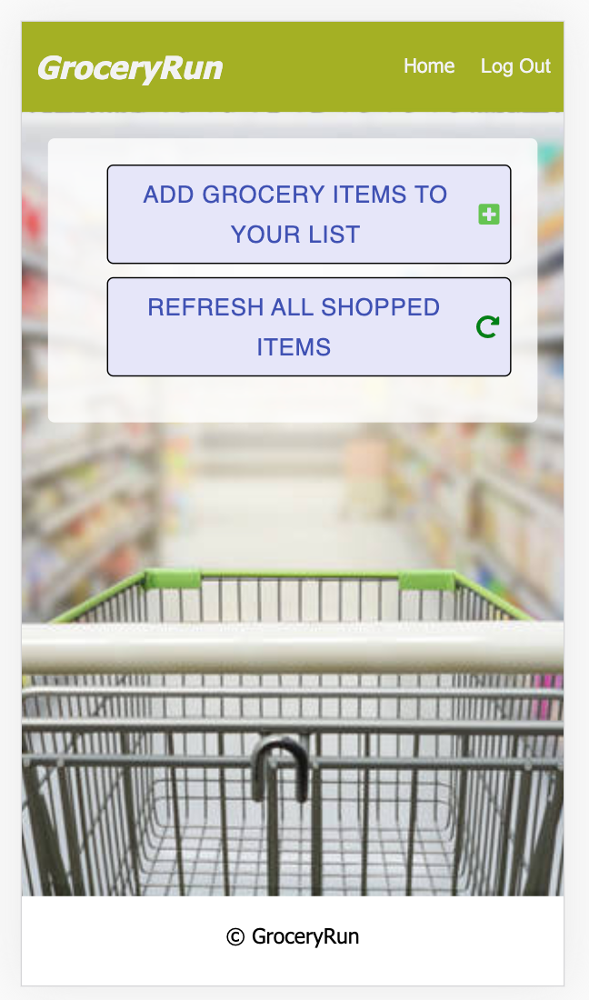
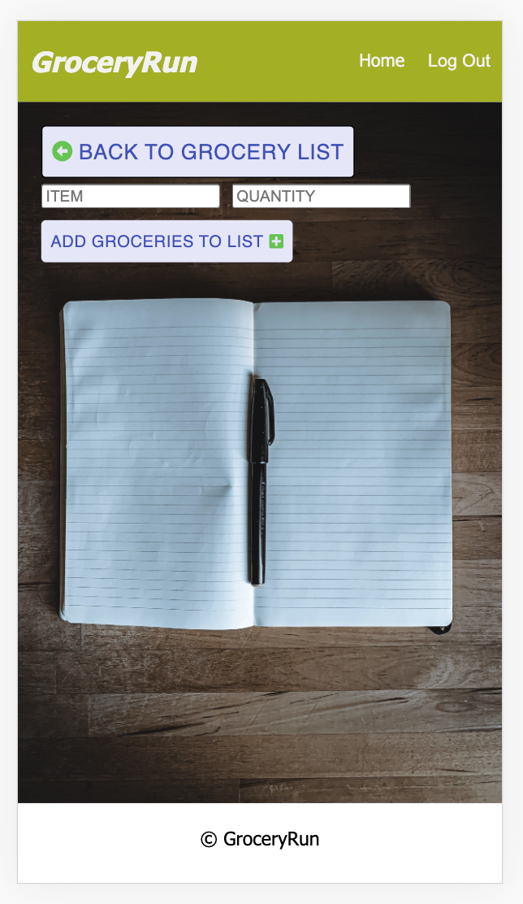
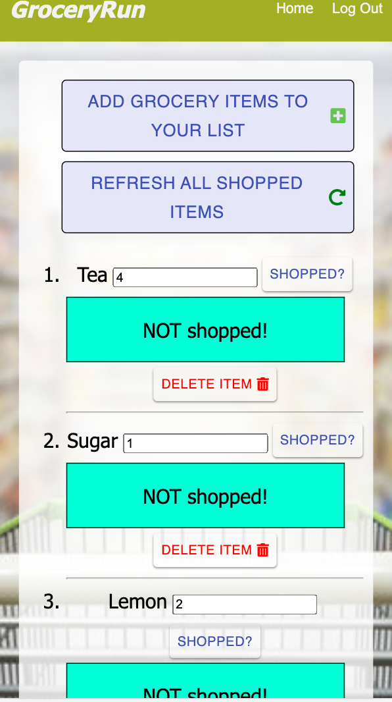

GroceryRun

## Description

Duration: 2 Week Sprint

GroceryRun is a web based mobile apllication that's designed and developed for users to make a grocery list, edit the list, and save list items to a database connected to their account information. This app solves the problem of manually making a list for grocery shopping for multiple people without being in proximity of one another.

To see the fully functional site, please visit:

## Screen Shot








## Prerequisites

Install the following software on your computer:

- [Node.js](https://nodejs.org/en/)
- [PostrgeSQL](https://www.postgresql.org/)
- [Nodemon](https://nodemon.io/)

## Installation

Create a database named grocery_run,
The project is built on Postgres, so you will need to make sure to have that installed. I recommend using Postico to run these queries as that was used to create the queries,

```SQL
-- add user table
CREATE TABLE "user" (
    "id" SERIAL PRIMARY KEY,
    "username" VARCHAR (80) UNIQUE NOT NULL,
    "password" VARCHAR (1000) NOT NULL,
    "admin" BOOLEAN default false
);

-- add groceries table
CREATE TABLE "groceries" (
    "id" SERIAL PRIMARY KEY,
    "user_id" int NOT NULL,
    "item" VARCHAR (1000) NOT NULL,
    "quantity" int,
    "shopped" BOOLEAN default false
);
```

Open up your editor of choice and run an npm install
Run npm run server in your terminal
Run npm run client in your terminal
The npm run client command will open up a new browser tab for you!

## Usage

1. Register an account with a new user name and password
2. Click Add New Groceries button
3. Add grocery items to your grocery list
4. Edit your grocery list by deleting an item, and/or clicking the 'Shopped?' button
5. You can refresh all shopped items by clicking the Refresh all shopped items button
6. Pass along your login information to anyone that you want to have access to your account


# Built With

React, Redux, Express, Passport, PostgreSQL, FontAwesome, MaterialUI, and CSS (a full list of dependencies can be found in `package.json`).

# Acknowledgement

Thanks to Prime Digital Academy who equipped and helped me to make this application a reality. Thank you to the Prime instructors for being wonderful guides during this project. Thank you to the entire Ukkonen cohort for pushing forward as a team and supporting each other. Special thanks to Stav, Simon, Tom, Franz, and my family for unquestionable empowerment.

# Support

If you have suggestions or issues, please email me at tflak29@gmail.com